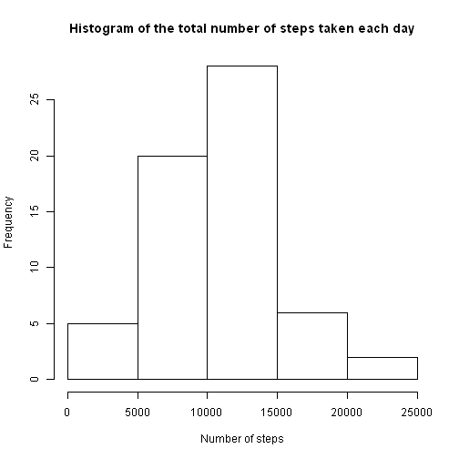

# Reproducible Research: Peer Assessment 1


## Loading and preprocessing the data

```r
library(data.table)
```

```r
setwd("e:\\5")
data <- as.data.table(read.csv("activity.csv"))

ii <- which(is.na(data$steps))
data.zeroed <- data
data.zeroed <- data.zeroed[-ii]
```

## What is mean total number of steps taken per day?


```r
totals <- data.zeroed[,sum(steps),by=date]
hist(totals$V1, main='Histogram of the total number of steps taken each day', xlab='Number of steps')
```

 

```r
mean(totals$V1)
```

```
## [1] 10766
```

```r
median(totals$V1)
```

```
## [1] 10765
```

## What is the average daily activity pattern?


```r
data.zeroed <- data
data.zeroed$steps[ii] <- 0
avg.values <- data.zeroed[,mean(steps),by=interval]
plot(avg.values$V1, type='l', main='Average daily activity pattern', xlab='Indes of 5-minute interval', ylab='The average number of steps taken')
```

 

```r
which.max(avg.values$V1)
```

```
## [1] 104
```

## Imputing missing values

Total count of NAs in data:


```r
ii <- which(is.na(data$steps))
length(ii)
```

```
## [1] 2304
```

For imputing we used averaged values for each interval:


```r
data.imputed <- data
data.imputed$steps <- as.numeric(data.imputed$steps)
jj <- match(data.imputed[ii]$interval, avg.values$interval)
data.imputed[ii]$steps <- avg.values$V1[jj]

totals <- data.imputed[,sum(steps),by=date]
hist(totals$V1, main='Histogram of the total number of steps taken each day', xlab='Number of steps')
```

 

```r
mean(totals$V1)
```

```
## [1] 10581
```

```r
median(totals$V1)
```

```
## [1] 10395
```

We can see that mean & median values become less than the estimates from the first part of the assignment.

We can suggest that decreasing of values was because of increasing count of observations (we deleted all NAs in first part of task), while average values for these intervals were rather small.


## Are there differences in activity patterns between weekdays and weekends?

You can see differencies in activity pattern on these plots:


```r
wdays <- as.POSIXlt(data$date)$wday
ii.weekends <- which(wdays==0 | wdays==6)
indicator <- rep('weekday', nrow(data))
indicator[ii.weekends] <- 'weekend'
indicator <- as.factor(indicator)
data.imputed <- cbind(data.imputed, indicator)

par(mfrow=c(2,1)) 
avg.values.days <- data.imputed[i=data.imputed$indicator=='weekday', mean(steps), by=interval]
plot(avg.values.days$V1, type='l', xlab='Interval', ylab='Number of steps', main='Weekday')
avg.values.ends <- data.imputed[i=data.imputed$indicator=='weekend', mean(steps), by=interval]
plot(avg.values.ends$V1, type='l', xlab='Interval', ylab='Number of steps', main='Weekend')
```

 
